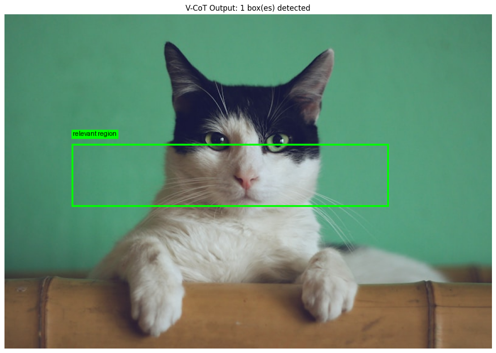

# Visual-CoT: Pixel-Grounded Reasoning with Interleaved Visual Chain-of-Thought

<div align="center">

**Grounding Reasoning in Vision-Language Models**

[](https://www.python.org/downloads/)
[](https://pytorch.org/)
[](https://opensource.org/licenses/Apache-2.0)
[](https://huggingface.co/)

*Teaching vision-language models to show their work with grounded visual reasoning*

[Demo](#demo) | [Features](#key-features) | [Quick Start](#quick-start) | [Training](#training-pipeline) | [Results](#results)

</div>

---

## Overview

**Visual Chain-of-Thought (V-CoT)** fine-tunes Large Vision-Language Models to produce **grounded reasoning traces** - explanations that interleave natural language deduction with precise bounding boxes pointing to visual evidence.

Instead of black-box answers, V-CoT models explain *what* they see, *where* they see it, and *how* they reached their conclusion.

### Before vs After

| Standard VLM | V-CoT Model |
|--------------|-------------|
| "The dog is running." | "Looking at the <ref>golden retriever</ref><box>[258, 436, 328, 484]</box>, I can see its legs are extended and mouth is open, indicating it's running energetically." |

### Output Format

```
First, I identify the <ref>red gear</ref><box>[100, 200, 300, 400]</box> in the mechanism.
Looking at how it connects to the <ref>blue lever</ref><box>[350, 180, 500, 250]</box>...
Therefore, when the gear rotates clockwise, the lever will move upward.
```

> Coordinates are normalized to 0-1000, where (0,0) is top-left and (1000,1000) is bottom-right.

---

## Demo

<div align="center">



*V-CoT identifying and grounding the main subject with a bounding box*

</div>

### Example Output

```
Question: What is in this image? Please provide the bounding box coordinate
          of the region that shows the main subject.

Image loaded: (800, 550)

Response:
────────────────────────────────────────
The cat has black and white fur, with its paws resting on what appears
to be an orange couch.

The <ref>relevant region</ref><box>[140, 392, 786, 572]</box> shows this
in the image.
────────────────────────────────────────

✓ Found 1 bounding box(es)!
Box 1: 'relevant region' -> pixels [112, 215, 628, 314]
```

The model:
1. **Identifies** the main subject (a cat with black and white fur)
2. **Describes** relevant details (paws on an orange couch)
3. **Grounds** its response with a precise bounding box
4. **Visualizes** the box on the original image

---

## Key Features

- **Grounded Reasoning** - Every claim is backed by visual evidence with precise bounding boxes
- **VisCOT Dataset** - Train on 150K+ samples with real bounding box annotations
- **Optimized Training** - NEFTune, early stopping, cosine LR schedule, and gradient checkpointing
- **4-bit QLoRA** - Efficient fine-tuning on consumer GPUs (16GB+ VRAM)
- **Pre-tokenization** - Robust VLM training that avoids multimodal collator issues
- **Streaming Demo** - Watch bounding boxes appear in real-time as the model reasons
- **Checkpoint Resume** - Seamlessly resume training from any checkpoint

---

## Architecture

```
┌─────────────────────────────────────────────────────────────────┐
│                        V-CoT Pipeline                           │
├─────────────────────────────────────────────────────────────────┤
│                                                                 │
│  ┌──────────┐    ┌──────────┐    ┌──────────┐    ┌──────────┐  │
│  │  VisCOT  │───▶│  Pre-    │───▶│  QLoRA   │───▶│ Grounded │  │
│  │ Dataset  │    │tokenize  │    │ Training │    │ Reasoning│  │
│  │ (150K)   │    │          │    │          │    │          │  │
│  └──────────┘    └──────────┘    └──────────┘    └──────────┘  │
│                                                                 │
│  Base Model: Qwen2.5-VL-7B-Instruct (4-bit quantized)          │
│  Training: SFTTrainer + NEFTune + Early Stopping               │
│                                                                 │
└─────────────────────────────────────────────────────────────────┘
```

---

## Quick Start

### Prerequisites

- **GPU**: NVIDIA with 16GB+ VRAM (A100/H100 recommended for full training)
- **CUDA**: 12.1+
- **Python**: 3.10+

### Installation

```bash
# Clone the repository
git clone https://github.com/your-org/Visual-CoT.git
cd Visual-CoT

# Create virtual environment
python -m venv venv
source venv/bin/activate  # On Windows: venv\Scripts\activate

# Install dependencies
pip install -r requirements.txt

# Install Unsloth (for optimized training)
pip install "unsloth[colab-new] @ git+https://github.com/unslothai/unsloth.git"
```

### Run the Demo (No Training Required)

```bash
# Use the base model to see the interface
python app/app.py --model_path unsloth/Qwen2.5-VL-7B-Instruct-bnb-4bit --share
```

---

## Training Pipeline

### Step 1: Generate Training Data

V-CoT supports two data sources:

#### Option A: VisCOT Dataset (Recommended)

Download and convert the VisCOT dataset with 150K+ samples containing real bounding boxes:

```bash
python scripts/generate_data.py \
    --source viscot \
    --output_dir data \
    --max_samples 150000
```

#### Option B: ScienceQA + GPT-4o Distillation

Generate reasoning traces using GPT-4o (requires API key):

```bash
export OPENAI_API_KEY="your-key-here"

python scripts/generate_data.py \
    --source scienceqa \
    --output_dir data \
    --max_samples 2000 \
    --save_images
```

### Step 2: Train the Model

```bash
# Standard training with optimized settings
python scripts/train.py --config configs/default.yaml

# Resume from checkpoint
python scripts/train.py --config configs/default.yaml --resume

# Use traditional approach (if pre-tokenization causes issues)
python scripts/train.py --config configs/default.yaml --no_pretokenized
```

#### Training Configuration

The default config (`configs/default.yaml`) includes optimized hyperparameters:

| Parameter | Value | Description |
|-----------|-------|-------------|
| `lora.rank` | 64 | LoRA rank for adaptation |
| `lora.alpha` | 128 | LoRA scaling factor |
| `learning_rate` | 1e-4 | Learning rate with cosine decay |
| `num_epochs` | 2 | Training epochs |
| `batch_size` | 4 x 4 = 16 | Effective batch size |
| `neftune_noise_alpha` | 5 | NEFTune noise for regularization |
| `early_stopping_patience` | 3 | Early stopping patience |

### Step 3: Evaluate

```bash
# Single image inference
python scripts/inference.py \
    --model_path outputs/checkpoints \
    --image_path path/to/image.jpg \
    --prompt "What is happening in this image? Show me the relevant regions."

# Batch evaluation with IoU metrics
python scripts/inference.py \
    --model_path outputs/checkpoints \
    --eval_jsonl data/val.jsonl \
    --output_json results/evaluation.json
```

---

## Interactive Demo

Launch the Gradio interface to see grounded reasoning in action:

```bash
# With trained model
python app/app.py --model_path outputs/checkpoints

# Create a public shareable link
python app/app.py --model_path outputs/checkpoints --share

# Custom port
python app/app.py --model_path outputs/checkpoints --port 8080
```

**Features:**
- Upload any image and ask questions
- Watch bounding boxes appear in real-time as the model generates text
- See the full reasoning trace with visual grounding

---

## Project Structure

```
Visual-CoT/
├── configs/
│   └── default.yaml          # Training hyperparameters (optimized)
├── data/
│   ├── train.jsonl           # Training data
│   └── val.jsonl             # Validation data
├── src/
│   ├── config_parser.py      # YAML + CLI config parsing
│   ├── dataset.py            # Data loading, pre-tokenization
│   ├── model.py              # Model factory (Unsloth/Transformers)
│   ├── trainer.py            # VCoTTrainer with NEFTune, early stopping
│   └── utils.py              # IoU metrics, visualization, logging
├── scripts/
│   ├── generate_data.py      # Data generation (VisCOT/ScienceQA)
│   ├── train.py              # Training entry point
│   ├── inference.py          # Inference & evaluation
│   └── verify_setup.py       # Environment verification
├── app/
│   └── app.py                # Gradio demo with streaming
├── Makefile                  # Convenience commands
├── requirements.txt          # Dependencies
└── pyproject.toml            # Package configuration
```

---

## Results

### Training Metrics

| Metric | Value |
|--------|-------|
| Training Samples | 135,000 |
| Validation Samples | 15,000 |
| Samples with Bounding Boxes | 100% |
| Average Response Length | ~150 chars |
| Training Steps | ~16,800 |
| Final Training Loss | ~0.62 |

### Evaluation Metrics

| Metric | Description |
|--------|-------------|
| **Grounding IoU** | Intersection over Union between predicted and ground truth boxes |
| **Box Detection Rate** | Percentage of responses containing valid bounding boxes |
| **Answer Accuracy** | Correctness of the final reasoning conclusion |

---

## Advanced Usage

### Custom Configuration

Override any config parameter via CLI:

```bash
python scripts/train.py --config configs/default.yaml \
    --training.learning_rate 5e-5 \
    --training.num_epochs 3 \
    --lora.rank 32 \
    --model.max_seq_length 4096
```

### Using Pre-trained Checkpoints

```python
from unsloth import FastVisionModel

# Load your trained model
model, tokenizer = FastVisionModel.from_pretrained(
    "outputs/checkpoints/final",
    load_in_4bit=True
)
FastVisionModel.for_inference(model)

# Run inference
from scripts.inference import infer
response = infer(model, tokenizer, "image.jpg", "Describe what you see.")
print(response)
```

### Google Colab Training

For cloud training, use the provided notebook:

```
V_CoT_Training_V2.ipynb
```

This notebook includes:
- Automatic Google Drive mounting for checkpoint persistence
- Pre-configured for A100/T4 GPUs
- Resume training from saved checkpoints

---

## Troubleshooting

### Common Issues

**Out of Memory (OOM)**
```bash
# Reduce batch size
python scripts/train.py --training.per_device_train_batch_size 2

# Or increase gradient accumulation
python scripts/train.py --training.gradient_accumulation_steps 8
```

**Slow Training**
- Ensure you have `unsloth` installed (2x speedup)
- Use `--pretokenized` flag (default) for faster data loading
- Enable gradient checkpointing (enabled by default)

**Missing qwen_vl_utils**
```bash
pip install qwen-vl-utils
```

---

## Citation

If you use V-CoT in your research, please cite:

```bibtex
@misc{vcot2024,
  title={V-CoT: Visual Chain-of-Thought for Grounded Reasoning},
  author={Your Name},
  year={2024},
  publisher={GitHub},
  url={https://github.com/your-org/Visual-CoT}
}
```

---

## References

- [Chain-of-Thought Prompting Elicits Reasoning in Large Language Models](https://arxiv.org/abs/2201.11903) (Wei et al.)
- [Shikra: Unleashing Multimodal LLM's Referential Dialogue Ability](https://arxiv.org/abs/2306.15195) (Chen et al.)
- [Qwen2-VL: Enhancing Vision-Language Model's Perception](https://arxiv.org/abs/2409.12191) (Wang et al.)
- [VisCOT: Visual Chain-of-Thought Dataset](https://huggingface.co/datasets/deepcs233/Visual-CoT) (deepcs233)
- [NEFTune: Noisy Embeddings Improve Instruction Finetuning](https://arxiv.org/abs/2310.05914) (Jain et al.)

---

## License

This project is licensed under the Apache License 2.0 - see the [LICENSE](LICENSE) file for details.

---

<div align="center">

**[Back to Top](#v-cot-visual-chain-of-thought)**

</div>
